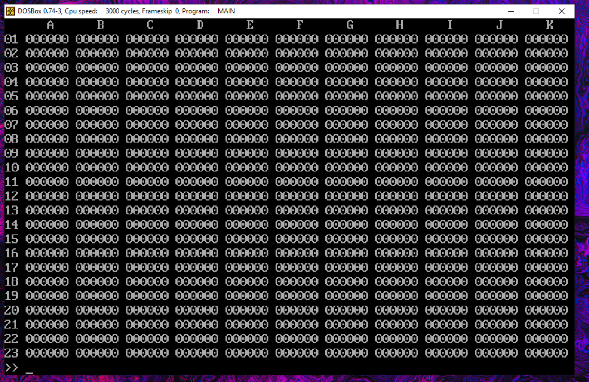
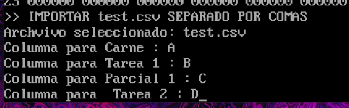
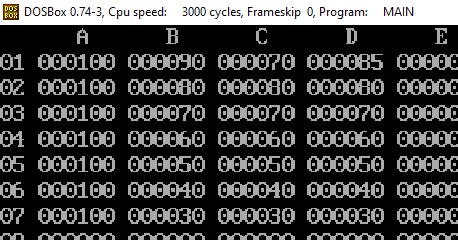
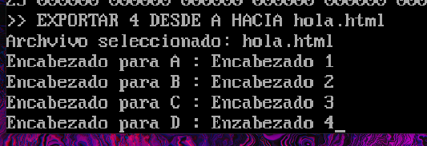
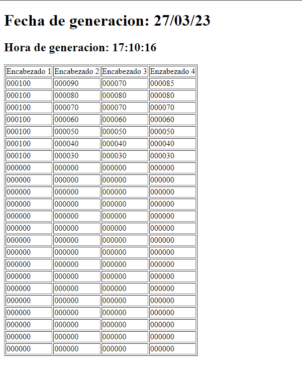

# **Práctica 4**
### Universidad de San Carlos de Guatemala
### Facultad de Ingeniería
### Escuela de Ciencias y Sistemas
### Arquitectura de Computadores y Ensambladores 1
### Sección B
  

## **Manual de Usuario**
  

| Nombre | Carnet | 
| --- | --- |
| Damián Ignacio Peña Afre | 202110568 |
----

# **Descripción General**

# **Descripción General**

Programa similar a excel. Realizado con el lenguaje ensamblador MASM. Permite realizar operaciones aritméticas, lógicas y de comparación, operaciones entre rangos y formas básicas de entrada y salida.

# **Requerimientos**
- DOSBox
- MASM

# **Ejecución**

1. Abrir DOSBox
2. Compilar el archivo `main.asm` con el comando `ml main.asm`
3. Ejecutar el archivo `main.exe` con el comando `main.exe`

# **Operaciones Sobre Celdas**

 * GUARDAR: Este comando permite guardar un número o valor en una celda específica. La sintaxis es: `GUARDAR [Número o celda] EN [Celda]`. Por ejemplo, si se desea guardar el número 5 en la celda A1, se escribiría: "GUARDAR 5 EN A1".

 * SUMA: Esta operación permite sumar dos números o celdas. La sintaxis es: `SUMA [Número o celda] Y [Número o celda]`. Por ejemplo, si se desea sumar los valores de las celdas A1 y A2, se escribiría: "SUMA A1 Y A2".

 * RESTA: Esta operación permite restar dos números o celdas. La sintaxis es: `RESTA [Número o celda] Y [Número o celda]`. Por ejemplo, si se desea restar los valores de las celdas A1 y A2, se escribiría: "RESTA A1 Y A2".

 * MULTIPLICACION: Esta operación permite multiplicar dos números o celdas. La sintaxis es: `MULTIPLICACION [Número o celda] Y [Número o celda]`. Por ejemplo, si se desea multiplicar los valores de las celdas A1 y A2, se escribiría: "MULTIPLICACION A1 Y A2".

 * DIVIDIR: Esta operación permite dividir dos números o celdas y obtener la parte entera del resultado. La sintaxis es: `DIVIDIR [Número o celda] ENTRE [Número o celda]`. Por ejemplo, si se desea dividir el valor de la celda A1 entre el valor de la celda A2, se escribiría: "DIVIDIR A1 ENTRE A2".

 * POTENCIAR: Esta operación permite elevar un número o celda a una potencia especificada por otra celda o número. La sintaxis es: `POTENCIAR [Número o celda] A LA [Número o celda]`. Por ejemplo, si se desea elevar el valor de la celda A1 a la potencia del valor de la celda A2, se escribiría: "POTENCIAR A1 A LA A2".

 * OLÓGICO: Esta operación permite realizar un OR lógico a nivel de bits entre dos números o celdas. La sintaxis es: `OLÓGICO [Número o celda] Y [Número o celda]`. Por ejemplo, si se desea hacer un OR lógico entre los valores de las celdas A1 y A2, se escribiría: "OLÓGICO A1 Y A2".

 * YLÓGICO: Esta operación permite realizar un AND lógico a nivel de bits entre dos números o celdas. La sintaxis es: `YLÓGICO [Número o celda] Y [Número o celda]`. Por ejemplo, si se desea hacer un AND lógico entre los valores de las celdas A1 y A2, se escribiría: "YLÓGICO A1 Y A2".

 * OXLÓGICO: `OXLÓGICO [Número o celda] Y [Número o celda]`
  Este comando ejecutará un XOR a nivel de bits con las cantidades brindadas como parámetros. El resultado de esta operación se colocará en el retorno.

 # **Operaciones Sobre Rangos**

 * LLENAR: `LLENAR DESDE [Celda de inicio] HASTA [Celda de fin]`
Este comando permite llenar un rango de celdas con valores numéricos ingresados por el usuario. El sistema reconocerá la orientación del rango especificado y solicitará al usuario ingresar un valor válido para cada celda del rango. En caso de que se ingrese un valor no numérico, se mostrará una advertencia y se solicitará al usuario ingresar un valor válido. Una vez que se hayan ingresado todos los valores, se verá reflejado el cambio en la cuadrícula con los datos ingresados colocados en su posición correcta. Esta operación no modificará la variable de retorno.

 * PROMEDIO: `PROMEDIO DESDE [Celda de inicio] HASTA [Celda de fin]`
Este comando permite obtener la parte entera del promedio de un rango. El resultado se colocará en la variable de retorno para su posterior uso.

 * MÍNIMO: `MÍNIMO DESDE [Celda de inicio] HASTA [Celda de fin]`
Este comando permite encontrar el valor mínimo en el rango especificado. El valor mínimo será el resultado que se colocará en la variable de retorno.

 * MÁXIMO: `MÁXIMO DESDE [Celda de inicio] HASTA [Celda de fin]`
Este comando permite encontrar el valor máximo en el rango especificado. El valor máximo será el resultado que se colocará en la variable de retorno.

 # **Operaciones de entrada y salida**

 * IMPORTAR: `IMPORTAR [Nombre del archivo] SEPARADO POR [COMA | TABULADOR]`
 Este comando permite importar los datos numéricos de un archivo separado por comas o tabuladores. La primera línea del archivo debe contener los nombres de los encabezados. Después de verificar que el archivo existe, el programa pedirá al usuario que especifique la letra de la columna donde se colocarán los datos correspondientes a cada encabezado. Los datos importados se colocarán en la columna indicada, comenzando desde la primera fila hacia abajo. Se verificará que las líneas no sobrepasen los 256 caracteres.

 * EXPORTAR: `EXPORTAR [Número] DESDE [Letra de columna] HACIA [Nombre de archivo]`
  Este comando generará un archivo .htm que contendrá los datos tabulados. Se exportarán [Número] columnas desde la columna [Letra de columna]. El programa pedirá al usuario el encabezado que cada columna tendrá en el archivo generado. La fecha y hora de exportación se incluirán en algún lugar del archivo generado. El programa verificará que la cantidad de columnas no sobrepase el número de columnas disponibles y realizará otras verificaciones pertinentes.
 
 

 # **Operaciones Varias**

 El comando `SALIR` será utilizado para salir del programa y cerrar la aplicación.
